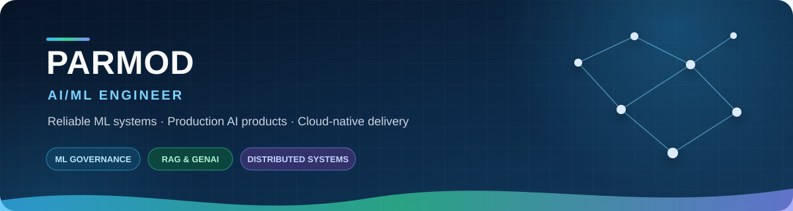

  

  
  
  

  I connect <strong>model quality</strong> with <strong>software reliability</strong>—building governed ML systems,
  grounded AI products, data platforms, and failure-aware cloud infrastructure.

<table>
  <tr>
    <td align="center" width="25%"><strong>4</strong> Flagship engineering systems</td>
    <td align="center" width="25%"><strong>351 passed</strong> Distributed-system release tests</td>
    <td align="center" width="25%"><strong>3</strong> Oracle Cloud AI/ML certifications</td>
    <td align="center" width="25%"><strong>400+</strong> Algorithmic problems solved</td>
  </tr>
</table>

## Engineering Profile

> I build AI/ML systems that can be **evaluated, governed, observed, recovered, and shipped**—not only demonstrated in a notebook.

- **Production ML:** reproducible pipelines, explainability, drift and fairness controls, staged promotion, rollback, and operational evidence.
- **Applied AI:** RAG, vector search, financial NLP, grounded LLM responses, retrieval evaluation, and multi-agent workflows.
- **Reliable platforms:** APIs, event processing, containers, CI/CD, observability, infrastructure as code, and cloud delivery.

## Flagship Engineering Work

<table>
  <tr>
    <td width="50%" valign="top">
      <h3>⚙️ Advanced Distributed System</h3>
      
<strong>Correctness-first runtime for reliable AI/ML services.</strong>

      
Causal CRDTs, durable recovery, mTLS node identity, reconciliation, OpenTelemetry, chaos testing, Kubernetes, Terraform, and AWS delivery.

      
<code>351 passed</code> · <code>8 skipped</code> · security and recovery smoke gates

      

        <a href="https://github.com/Parmodk2310/Advanced-Distributed-System">Repository</a> ·
        <a href="https://parmodk2310.vercel.app/projects/advanced-distributed-system">Case study</a>
      

    </td>
    <td width="50%" valign="top">
      <h3>🧠 CreditScoreV4 ML Governance</h3>
      
<strong>Evidence-backed lifecycle controls for credit-risk ML.</strong>

      
Data contracts, quality gates, drift, fairness, explainability, model integrity, staged promotion, rollback, monitoring, and incident traceability.

      
<code>Governed releases</code> · <code>Responsible AI</code> · <code>Audit evidence</code>

      

        <a href="https://github.com/Parmodk2310/CreditScorev4-ML-Governance">Repository</a> ·
        <a href="https://parmodk2310.vercel.app/projects/creditscorev4-ml-governance">Case study</a>
      

    </td>
  </tr>
  <tr>
    <td width="50%" valign="top">
      <h3>📊 RetentionOS</h3>
      
<strong>Product analytics and ML platform for retention decisions.</strong>

      
Funnels, cohorts, churn intelligence, experimentation, model health, and reliable event processing with FastAPI, React, PostgreSQL, Redis Streams, and GCP.

      
<code>Product analytics</code> · <code>A/B testing</code> · <code>Event-driven</code>

      

        <a href="https://github.com/Parmodk2310/Retention-Analytics-Platform">Repository</a> ·
        <a href="https://retentionos.34-0-15-46.sslip.io/">Live demo</a> ·
        <a href="https://parmodk2310.vercel.app/projects/user-retention-platform">Case study</a>
      

    </td>
    <td width="50%" valign="top">
      <h3>📈 AXIOM Portfolio Intelligence</h3>
      
<strong>Risk-aware research platform for explainable portfolio decisions.</strong>

      
Constrained optimization, FinBERT sentiment, FAISS retrieval, grounded AI commentary, containerized delivery, and AWS deployment.

      
<code>FinBERT</code> · <code>FAISS RAG</code> · <code>Adaptive MPT</code> · <code>AWS</code>

      

        <a href="https://github.com/Parmodk2310/AXIOM-Portfolio-Intelligence">Repository</a> ·
        <a href="http://15.252.103.217:8501/">Live app</a> ·
        <a href="https://parmodk2310.vercel.app/projects/portfolio-optimizer">Case study</a>
      

    </td>
  </tr>
</table>

The cards provide decision context; the pinned repositories below remain the source for code, documentation, releases, and engineering history.

## Engineering Dossier

| System concern | Implementation evidence |
|---|---|
| **Distributed correctness** | Causal CRDTs, deterministic merge behavior, durable restart recovery, SWIM membership epochs, anti-entropy reconciliation |
| **Security boundaries** | mTLS identity, trusted-CA enforcement, wrong-node rejection, plaintext rejection, secret-safe delivery |
| **Governed ML delivery** | Data contracts, model integrity, evaluation gates, explainability, drift and fairness checks, promotion and rollback |
| **Production AI** | Retrieval pipelines, FAISS vector search, grounded generation, financial NLP, LLM evaluation and multi-agent orchestration |
| **Operational reliability** | Prometheus metrics, OpenTelemetry traces, Grafana dashboards, chaos scenarios, CI/CD and infrastructure as code |

  
<strong>How I approach engineering decisions</strong>

   
  <ul>
    <li><strong>Define the failure model first:</strong> identify what can become unavailable, inconsistent, unsafe, or misleading.</li>
    <li><strong>Turn requirements into evidence:</strong> encode behavior in tests, release gates, observability, and reproducible demonstrations.</li>
    <li><strong>Prefer explicit trade-offs:</strong> document consistency, latency, reliability, cost, and operational complexity.</li>
    <li><strong>Design for recovery:</strong> treat rollback, restart behavior, degraded dependencies, and incident traceability as product features.</li>
  </ul>

## Technology System

  
  
  
  
  
  
  
  
  
  
  
  

| Area | Working toolkit |
|---|---|
| **ML and AI** | Scikit-learn · TensorFlow · XGBoost · SHAP · LangChain · FAISS · FinBERT · RAG |
| **Backend and data** | FastAPI · Flask · PostgreSQL · Redis Streams · REST APIs · asynchronous processing |
| **Platform engineering** | Docker · GitHub Actions · Kubernetes · Terraform · Prometheus · OpenTelemetry |
| **Cloud** | AWS · GCP · Oracle Cloud Infrastructure |

## Background and Credentials

<table>
  <tr>
    <td width="55%" valign="top">
      <h3>Experience</h3>
      <ul>
        <li><strong>AI Research Intern — Coding Jr</strong> Led a 10-member research team studying an AI Co-Pilot ecosystem and contributed to its integration framework.</li>
        <li><strong>Data Science Intern — Innomatics Research Labs</strong> Built retrieval-augmented and assistive AI workflows using LangChain and Gemini.</li>
        <li><strong>Data Science Intern — Acmegrade</strong> Developed predictive ML projects with EDA, feature engineering, evaluation, and model optimization.</li>
        <li><strong>Engineering Intern — OpenQQuantify</strong> Worked across RF/IoT visualization, RISC-V emulation, and multi-agent circuit-design workflows.</li>
      </ul>
    </td>
    <td width="45%" valign="top">
      <h3>Education and Credentials</h3>
      <ul>
        <li><strong>M.Sc. Computer Science</strong> Maharshi Dayanand University, Rohtak</li>
        <li><strong>3 Oracle Cloud AI/ML certifications</strong> Generative AI · Data Science · AI Vector Search</li>
        <li><strong>400+ algorithmic problems</strong> Data structures, algorithms, and problem solving</li>
      </ul>
    </td>
  </tr>
</table>

## Writing

### [How Search Engines Understand and Deliver Results](https://medium.com/@parmod007p/how-search-engines-understand-and-deliver-results-6904e7c9b4a3)

An accessible technical explanation of search architecture, distance metrics, relevance, query rewriting, and query understanding.

---

  <strong>Build → Verify → Observe → Improve → Ship</strong>

  Open to <strong>AI/ML Engineer</strong>, <strong>Generative AI Engineer</strong>, and <strong>ML Platform Engineer</strong> opportunities.

  <a href="https://parmodk2310.vercel.app">Portfolio</a> ·
  <a href="https://linkedin.com/in/parmodk2310">LinkedIn</a> ·
  <a href="https://medium.com/@parmod007p">Medium</a>

